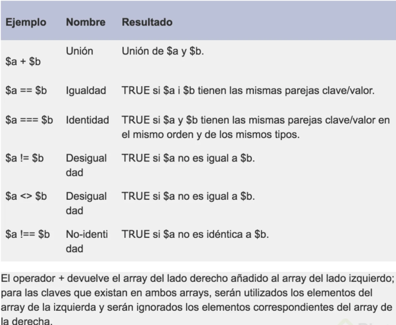

# PHP-Project
This is a small project developed in PHP, where it is implemented:  Object-oriented programming. Connection to databases. We will use PHP standards. We will implement third-party libraries. We will structure our project in a very professional way. We will use PHP version 7.2.

## What is PHP?
PHP is a high-level general-purpose programming language that was specially designed for the development of web applications.

It is interpreted, cross-platform, open source, which has been very popular in recent years.

What is NOT PHP?

It is not a compiled language, so you will always have to carry your code and your interpreter together.
It is not designed to make desktop applications.
To work with PHP we will install a development environment called XAMPP, it is not an environment designed for production.

## PHP SYNTAX
Whenever we use PHP we will use the following: <? Php?> Everything we put inside this will be what the server will interpret as php code, whatever is outside it will ignore it.

To access it we will do it localhost: 8080 / hello.php because the server opens the index file by default and our new file is called hello.php.

If we want to write php code in our HTML view we will have to change the file extension to .php because our server is configured to interpret only PHP files. Only the parts within <? Php?> They will be interpreted and their source code will not be visible from the browser.

All code statements are separated by a; (semicolon).

## Variable data types and strings
A variable can be a small box in which you can store a value and it can be used to perform an operation.

To declare it we will use the $ symbol and then the name, it can be a _ or a letter.

PHP is not statically typed, meaning we don't have to tell you what kind of data that variable is. Furthermore, it is weakly typed because we can easily change the data type, ie PHP performs an internal data conversion.

When working with PHP, a very important thing is to debug our variables, for this we use the var_dump () function; passing by parameter the variable to review.

In PHP we have two types of strings, those with single quotes and those with double quotes. The difference between these two strings is that the one with single quotes literally receives what you write to it, while the one with double quotes tries to interpret any variable within it.

## Data types in PHP
PHP has many types of data, however, at this moment we are going to focus on the most important and used ones that are boolean, integer, float, string, array and NULL.

### Scalar types:
* boolean:

    Represents only a true or false value. 
http://php.net/manual/es/language.types.boolean.php
Valid values: true (true) false (false)
    ```php
        <?php
            $a = true; 
            $b = false; 
        ?>
    ```

* Integer:

    Represents a positive, negative, or 0 integer. 
http://php.net/manual/en/language.types.integer.php
    ```php
        <?php
            $a = -123;
            $b = 0;
            $c = 7763;
        ?>
    ```

* Float or double: 

    Represents a floating point number, there are precision problems with floating numbers due to the binary nature of computers. 
http://php.net/manual/es/language.types.float.php
    ```php
        <?php
            $a = 12.24; 
            $b = 1.5e3; 
            $c = 7E-10;
        ?>
    ```

* string:

    - Represents a character string.
    - There are 4 ways to represent a chain. The main 2 are using single quotes or double quotes.
        - Using single quotes where the text will be exactly as it is written.
        - Using double quotes allows you to use escape characters and also expand the names of the variables, that is, it substitutes the value of the variables inside the strings.
    - There are 2 additional ways called Heredoc and Nowdoc that are used to create multi-line strings.

    More data type:
https://www.php.net/manual/es/language.types.string.php#language.types.string.details
    ```php
        <?php
            $a = ”Hola”; 
            $b = ‘Mundo’; 
        ?>
    ```
---

### COMPOSITE TYPES
* Array 

    It represents a collection of values, although by default PHP used numerical indexes, the reality is that the structure is represented as a map that collects key-value pairs. The syntax to define an array will be from square brackets, although in previous versions of PHP it was necessary to use the array () function. The curly braces can be integers or strings, and the values can be of any PHP type, including an array type.
    http://php.net/manual/es/language.types.array.php

    ```php
        <?php
            $array = array(
                "curso1" => "php",
                "curso2" => "js",
            );

            // as of PHP 5.4
            $array = [
                "curso1" => "php",
                "curso2" => "js",
            ];

            // numerical indices
            $array = [
                "php",
                "js",
            ];
        ?>
    ```

* object:

    Represents an instance of a class. We will take a closer look at this topic in the Object Oriented Programming class.
    ```php
        <?php
            class Car
            {
                function move()
                {
                    echo "Going forward..."; 
                }
            }

            $myCar = new Car();
            $myCar->move();
        ?>
    ```

* Callable:
    
    It is a special data type that represents something that can be "called", for example a function or a method.
    ```php
        <? php
        // Variable that stores a callable
        $ firstOfArray = function (array $ array) {
            if (count ($ array) == 0) {return null; }
            return $ array [0];
        };

        // This is our arrangement
        $ values = [3, 2, 1];

        // We use our callable and the value 3 is printed
        echo $ firstOfArray ($ values);
    ?>

* iterable:

    As of PHP 7.1 iterable it is a pseudo data type that can be traversed.
    ```php
        <?php

            function foo(iterable $iterable) {
                foreach ($iterable as $valor) {
                    // ...
                } 
            }
        ?>
    ```
---

### Special types:
* resource:
    
    It is a special data type that represents an external resource, for example a file external to your application.
    ```php
        <?php
            $res = fopen("c:\\dir\\file.txt", "r");
        ?>
    ```

* NULL:

    It is a special value that is used to represent a valueless variable. 
    http://php.net/manual/es/language.types.null.php
    ```php
        <?php
            $a = null; 
        ?>
    ```

## Arrays

These variables that store more than one data are known as arrays and their syntax is indicated with [] (square brackets).

PHP uses indexes to locate the elements within the variable.

The array structure in PHP is known as a map, which means it has a key value composition. Also, an array can contain more arrays and each one will follow the same structure.

Something you should know is that in PHP you can store different types of data in the same arrangement.

## Conditionals and Cycles
The conditions allow us to make decisions in the code, if the condition is fulfilled then certain instructions will be executed if not, others will be executed. These are denoted by the **if else statement.**

The cycles work hand in hand with the conditions, in this case if the instruction is fulfilled a given instruction will be executed repeatedly.

We have added the jobs manually by accessing the array through their indexes, doing this could bring errors and we could not control it if we had many jobs. Now let's see a better way to do it with cycles.
* The first one we have is do while, which will involve the initialization of variables and conditions.
* The second we will see is for which is a more simplified way of using all the elements that make up the cycles.

## While vs Do While
### Cycles
As we mentioned in our previous class, cycles or loops are of utmost importance when developing software because they allow us to repeat a block of actions and consequently re-use our code better, at this point we have already talked about how the for cycle and the cycle work do-while.

Now we are going to review a couple of additional cycles in PHP which are also important to know. Take into account that most things can be done in different ways, so it is important that you choose the cycle that best suits your problem.

### while vs. do… while
In the previous class we talked about the do while cycle, here we will compare it with another cycle called while, let's recap the operation of do ... while:

When we create a do ... while loop, we tell PHP to execute a certain code block as long as the condition you have inside is still being evaluated as true.

This is the syntax of a do… while loop
```php
do {
   code…
} while (condition)
```

The while loop works the same way, but the main difference is that the evaluation will be done at the start of the loop:
```php
while (condition) {
   code...
}
```

The main difference is that the do while loop ensures that the internal code will run at least 1 time, whereas in the while loop if the condition is false from the start, the loop may never run

http://php.net/manual/es/control-structures.while.php
http://php.net/manual/es/control-structures.do.while.php

### foreach
The foreach cycle gives us a simple solution to iterate over the values ​​of an array, the syntax is as follows:
```php
foreach ($array as $ value) {
    statements that can use $value
}
```

In this syntax we find 4 parts:
* The foreach keyword simply indicates the start of our block
* Inside brackets the name of the array that we are going to be iterating is written, this array must be previously defined, in this example it is $ array
* The word "as" followed by a variable name that we will use to access the element of the array that we are accessing, this variable must not previously exist and can only be used within this block. In the example it is $ value.
* Between braces “{}” all the actions that we want to repeat, at the moment the cycle is executed the variable that we define to iterate (in the example $ value) already exists and can be used in this section, think that the value of This variable will be changing in each iteration.

Assuming that in the previous example $ array = ['one', 'two', 'three'], the cycle will repeat 3 times and in each iteration the variable $ value will contain the element of the corresponding array, that is, in the first iteration $ value will be equal to 'one', in the second $ value it will be equal to 'two' and in the third $ value it will be equal to 'three'.

There is an alternative syntax that allows us not only to know the value, it will also allow us to know the key, this way we will have access to both the key and the value of the array element:
```php
foreach ($array as $key => $value) {
    statements that can use $key and $value
}
```

http://php.net/manual/es/control-structures.foreach.php

## Operators, conditionals, continue and break.
In PHP there are four main types of operators:
* Arithmetic.
* Assignment.
* Conditionals.
* Increase.

Let's take the time to practice and see more about conditions, in PHP we have the comparison operator (==) and different from (! =).

We have the **continue** statement which when executed will cause it to iterate to the next line of the array. And the **break** statement that will make the cycle end.

## Operators
It's important to mention that there is a concept known as operator precedence which will allow us to know in which order the operators found in a single statement should be executed.

For example, in the statement:
**1 + 2 * 3**

Operation **2 * 3** will be executed first
Then the sum will be executed with **1**

This is because * has more precedence value than +.

An easy way to control the precedence is using () parentheses, this way we can force the order that we want, for example (1 + 2) * 3 will be a different version and the addition will be executed first and then the multiplication.

See more information about it: 
http://php.net/manual/es/language.operators.precedence.php

### Arithmetic operators
http://php.net/manual/es/language.operators.arithmetic.php

They function to perform arithmetic operations:


### Assignment operators
http://php.net/manual/es/language.operators.assignment.php

The main assignment operator is the symbol = (equal). It is important to note that this operator is not for comparison, normally on the left side of the operator we will have a variable, and this operator is used to assign the result of what is on the right to that variable.

$variable = 5;

What we have on the right can be a value, another variable, or the result of an operation or function.

There are also other assignment operators that are combined with arithmetic or string operators and allow us to simplify some statements within PHP. These are examples of how they work:
```php
<?php
    $a += $b
    $a = $a + $b

    $a -= $b
    $a = $a - $b

    $a *= $b
    $a = $a * $b

    $a /= $b
    $a = $a / $b

    $a %= $b
    $a = $a % $b

    $a .= $b
    $a = $a . $b
?>
```
### Comparison operators
http://php.net/manual/es/language.operators.comparison.php

They allow us to compare values.


### Increment / Decrement Operators
http://php.net/manual/es/language.operators.increment.php

They allow to increase or decrease a value by 1.


It is very important to understand how the place where the operator is established affects, example:
```php
<?php 
    $a = 1;
    echo $a++;
    echo $a;
    echo ++$a;
    echo $a;
?>
```

print
```terminal
1
2
3
3
```

### Logical operators
http://php.net/manual/es/language.operators.logical.php

They allow us to combine comparison results.


### Operators for strings
There are 2 operators for strings the. (period) that allows us to concatenate strings, and the. = that was previously seen and allows us to simplify the syntax of concatenating something to the same string, example:
```php
<?php
    $var1 = ‘Hello’ . ‘Php’;
    $var1 .= ‘!!!’;
    echo $var1;
?>
```
Print:
```terminal
Hello php !!!
```

### Array operators
http://php.net/manual/es/language.operators.array.php



## Functions
The functions in PHP are denoted by the keyword function followed by the name of the function, the functions will serve to call and reuse code in our projects.

When we work with functions, it is very important to take care of the scope of the variables, as some may enter their scope and others may not.

PHP functions may or may not return a particular data. If we want to do it we can indicate it with the reserved word return.

## Adding external files
We will better organize our code for this we will separate it in another file called jobs.php.

We will use the **include** keyword include to make the index file include the jobs.php file, if it finds it it includes it, but it will not show us a warning. There is another call **require** that if it is not found it shows us an error in the whole file.

The include and require methods execute the code of the file every time they include it, this can bring errors in the execution of your code if you have files with functions because it will tell you that you cannot declare a function with the same name twice. To solve this there are **include_once** and **require_once** that force to include the file only once.

## Object oriented programming
Object-oriented programming will help us better structure our programs. PHP as of version 5 has object oriented implementations, which makes it more reusable and maintainable.

A class is a template or definition of something. And an instance is the concrete representation of the class.

Encapsulation will be the level of visibility that we want to give to some variable, for this we can use the access modifiers **private**, **public** and **protected**.

With the reserved word **this** we will be referring to the variable that belongs to the class.

## Constructor and Methods
The constructor method will allow us to initialize default values, as well as pass data as a parameter when initializing an object.

### Magic PHP methods
All functions that have __ before the function name are known as magic methods.

https://www.php.net/manual/es/language.oop5.magic.php

## Heritage
Inheritance allows certain classes to have characteristics of a parent class. This class will be called son.

As a good practice in PHP it's best to have the code divided into different files. This is exactly what we will do with the definition of the Jobs class, which should now have the same file name, this will be BaseElement.php.

Now in another file we will create the Job class that will be the daughter of BaseElement.php. We will express the inheritance with the extends keyword.

It is very convenient to use require_once when we want to use inheritance and include classes that are in other files.

Within our child class we can override some method of the parent, this is a concept that we know as polymorphism. What polymorphism means is that we will have a method that will work according to its context where it is called.

If we have properties with the word private in our parent class, from our daughter class we will not be able to access this property, but if we want it to remain private and the daughter classes have access, we can use the protected keyword.

## Heritage and polymorphism

When working with objects and classes, we can sometimes come across classes that are very similar, even containing some methods or properties, but that are not completely the same.

At this point we talk about Inheritance, a concept that allows us to reuse all the parts that are common and allow us to have what is not common in separate classes.

Inheritance works as an inheritance string, that is, we can have a class and generate a "daughter class" from it, the "daughter" class reuses all the properties and methods of the "parent" class and also allows you to implement those parts that make it different.

For example, we believe that we are building an e-commerce system that handles digital books and music albums, so that we can generate an inheritance chain like the following:


Product (id, title, price, description)
Book (isbn, publisher, author, pages, profitBonus) extends the Product
Album (company, artist, duration, genre) extends the product

In this example, a book is different from an album in some ways, however there are certain properties that are shared through the Product parent class, thus both classes including product properties and methods but in addition to that they implement properties and unique methods.

Now we are going to talk about an additional concept, which is also very important, the term is **polymorphism** and means "many forms".

Let's think that we want to calculate the profit that we will get from the sale of certain products, and in this case books and albums handle different percentages of profit, if we generate a getProfit method in the Product class this method could define how few we will earn from each product . For example, let's think we earn 10%.

```php
public function getProfit () {
    return $price * 0.1;
}
```

Adding this method within Product allows us to use it on objects of the Product class and also on specific objects in the daughter classes of Product, now, we are going to think that books handle a different formula because it handles an additional bonus value, in this case we could have the getProfit method but now declared inside the Reserve class and use the unique logic of this class:
```php
public function getProfit () {
    return $ price * (0.1 + $this->profitBonus);
}
```

This concept is a type of polymorphism which we call Overwriting and what allows us to replace something that was already defined in a parent class.

An example of use for this inheritance chain is, for example, if we have a list of products, some of them are books and other albums, and if we want to know the total earnings, we simply have to go through the elements and add the result of the getProfit method and in each case the object will know the specific formula used because it is defined inside its class.

In short, inheritance allows us to reuse the code between our classes and polymorphism, in this example overwriting, can help us classes that can react differently to methods with the same name.

## Interfaces
The interfaces can be seen as a contract or an agreement in which certain things can be standardized.

The reserved word that we will use to declare an **interface** will be interface. And the one that will indicate that we are using an interface in a class will be **implements**.

Using **Type Hinting** we will establish the type of data that we expect either a class or a specific data type.

Inheritance in PHP will be simple, that is, it will only be able to inherit a single class, on the contrary, with the interfaces that we can implement several at the same time.

## Namespaces
This is a way to keep the file names unique in the same directory.

This allows us to better organize the project.

The keyword namespace is used to declare a private **namespace.**

## PSR and PHPFIG
https://www.php-fig.org/
Several programmers came together to create a group called **PHP-FIG** with the aim of advancing the interoperability of libraries in PHP.

This group created the **PSR** which are recommendations and standards for your PHP code.

## Composer
https://getcomposer.org/download/
We are going to add to our project a PHP dependency manager called Composer, it will not only help us to bring third-party libraries to the project, it will also implement the PSR4 standard that will allow us to have automatic file loading.
https://www.php-fig.org/psr/psr-4/

composer.phar will be a document that will help us manage dependencies in PHP, this goes very hand in hand with another file called composer.json.

Inside our folder, run the next command:
```terminal
 $ php composer.phar install
```

## Introduction to databases
The databases are collections of data that we can use to consult it, store it, execute filters, etc.

When we talk about web applications we will work with database management systems, also known as relational databases.

XAMPP comes with a tool called phpMyAdmin which is a client which connects to a database, in this case it connects to MariaDB.

## ORM
An ORM, which stands for Object Relational Mapping, is a concept in which we are going to create within our code some models based on the tables in our database.

A main characteristic of an ORM is that it makes connections to PostgreSQL and MySQL more transparent, it also protects us from some SQL vulnerabilities and facilitates some validation of the information.

### PDO (PHP Data Object)
It allows standardizing how to work with different database management systems.